# Getting Started

This document will help you get started building applications with Spring Boot that run on Kubernetes and various distributions of Kubernetes (ie, OpenShift v3.x).
 
 
## Make JAR not WAR. We need Moar!
Spring Boot is a great way to build simple Java microservices and has a vibrant ecosystem to help facilitate. Spring Boot and its surrounding ecosystem go to great lengths to help developers get started with microservices including taking some of the pain out of configuration, health checking, boostrapping etc. For example, Spring Boot prefers an "uber-jar" model of packaging a microservice which is executable on its own. This helps  reduce the many mistakes that can happen when trying to juggle application servers + WARs/EARs as well as simplifies the classloading model for those apps that can get away with it. When we're deploying lots of microservices, we want to eliminate configuration drift as much as possible and reason about our apps without adding complications between environments.
 
Building to uber jars does help with this but is not the end of the story. As we further our quest to reduce configuration drift between environments for our apps we must also be aware of this fact: A Java based microservice depends fully on a JVM. The JVM *is* a very important implementation detail of our Java application. As are the dependencies and transitive dependencies of the JVM (libc, etc). A developer that created an app using a particular JVM on, let's say, Windows could potentially behave quite differently on a different JVM running on Linux (in a QA environment, let's say). You'll want a way to capture the complete snapshot of binaries that make up you application and Linux Containers and associated image formats is a great way to do that. 

## Isn't Docker and Kubernetes complicated?
There's an interesting dynamic between "yah we need this" and "well, it's too complicated". We can hope and pray and ignore it? But really, what if we just made it easier to build your Docker images and deploy to Kubernetes? That's what the fabric8 tooling does for you. It allows you to just use the same developer tools you use today and take advantage of building and deploying cloud-native applications on Kubernetes. 

## Do I need to do anything different for my Spring Boot app?
No! Here's how we get started.
 
## Create your Spring Boot application

Go to http://start.spring.io and create your app. That's it. You have other options too:

1. With Spring Tool Suite (STS)
2. with Spring Initializr CLI
3. With JBoss Developer Studio (see below)
4. With IntelliJ, Eclipse, Netbeans (via JBoss Forge -- see below)
5. With the Fabric8 console for CI/CD

We can also do with these, but will be covered in a different section:

* With JBoss Forge CLI
* With maven archetypes/fabric8 quickstarts


### Spring Initializr and friends

STS, start.spring.io, and the spring-boot CLI all use Spring Initializr under the covers. At the moment, the best way to get started with the Fabric8 tooling is by adding the Fabric8 Maven Plugin:

```
<build>
  ...
     <plugins>
       <plugin>
       <groupId>io.fabric8</groupId>
       <artifactId>fabric8-maven-plugin</artifactId>
       <version>${fabric8.maven.plugin.version}</version>
       <executions>
         <execution>
           <goals>
             <goal>resource</goal>
           </goals>
         </execution>
       </executions>
       </plugin>
  ...       
```

### JBoss Developer Studio

JBoss Developer Studio has JBoss Forge tooling installed by default. Press `CTRL+4` or `CMD+4` if on Mac to get the forge window. If you haven't already, install the Fabric8 `devops` plugin which will enable the Spring Boot project wizards. You can install the addon from within JBDS by hitting `CTRL/CMD+4` and type `addon` and find the option for installing. Use the coordinate below:

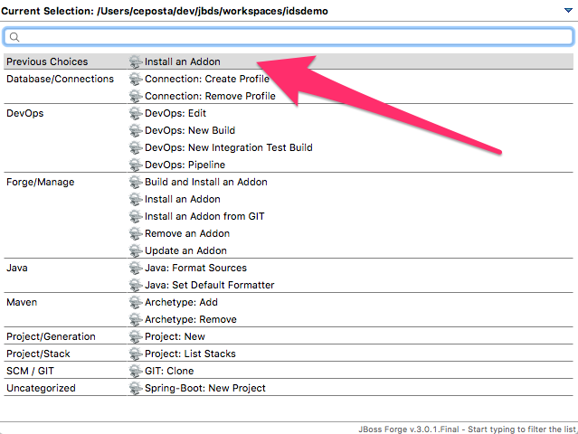

```
addon-install --coordinate io.fabric8.forge:devops,2.3.18
```

Quick Note: You can also install this from the CLI.

Now when you `CTRL/CMD+4` you can type `project` and select the `Project New` option. When you begin creating the new project, fill in the Project Name, Package Name, etc. and make sure to change the Project Type to 'spring boot':
 


When you click "Next", you can choose the dependencies you like for your project (just as you can from any Spring Initializr dialog including start.spring.io). 

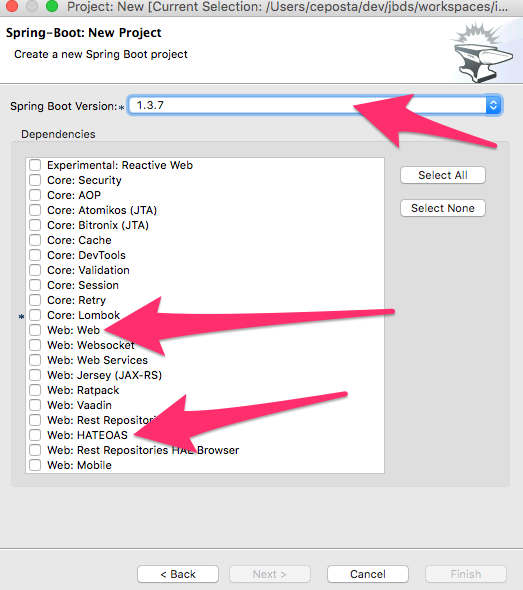

Clicking "Finish" will create the project for you. At this point you have a skeleton Spring Boot project into which you can add your own amazing business logic.

What about when you're ready to start using the Fabric8 tooling and build Docker images for your Kubernetes installation? 

Select the project in your project/package explorer and then hit `CTLR/CMD+4` and type `fabric8` into the dialog box filter. You should see an option for *Fabric8 Setup*. 

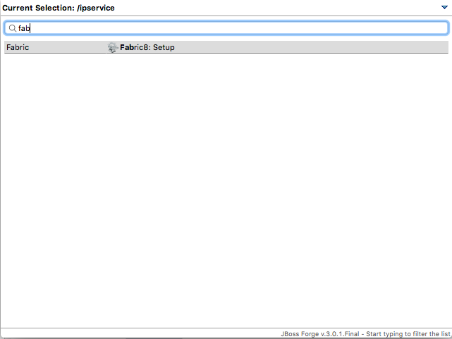

When the next dialog box comes up you can add metadata about which Docker image to use or which Main class to bootstrap, but in our case the fabric8 tooling is going to pick sensible defaults since it will auto-detect we have a Spring Boot application. Just click "Finish"

Now if we take a look at the pom.xml, we'll see that our `fabric8-maven-plugin` has been added:


You're now in business! Skip to the section titled "Spring Boot on Kubernetes" if you're not interested in set up for IntelliJ. Or, watch a video of doing this whole process here:

<iframe src="https://player.vimeo.com/video/180053437" width="640" height="360" frameborder="0" webkitallowfullscreen mozallowfullscreen allowfullscreen></iframe>
<p><a href="https://vimeo.com/180053437">Spring Boot, Spring Cloud with Kubernetes and Fabric8</a> from <a href="https://vimeo.com/ceposta">Christian Posta</a> on <a href="https://vimeo.com">Vimeo</a>.</p>


### IntelliJ

JBoss Forge doesn't come out of the box with IntelliJ but through IntelliJ's amazing plugin system, we can easily added it! Just note, you should be running IntelliJ with JDK 1.8+. Newer versions of IntelliJ bundle and use JDK 1.8 out of the box. If you've an older version of IntelliJ, hit `CMD/CTRL+SHIFT+A` to get the `All Actions` dialog box and start typing `SDK`. Follow the instructions to change the SDK. 

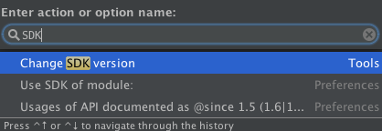

Now you can go to the plugins dialog box and find JBoss Forge:


Now you can `CTRL+ALT+4` or `CMD+OPTION+4` on Mac to get the Forge dialog box:


Just like with the JBDS example, we'll find the "Project New" option, fill in the project information, and make sure to select Project Type of Spring Boot:

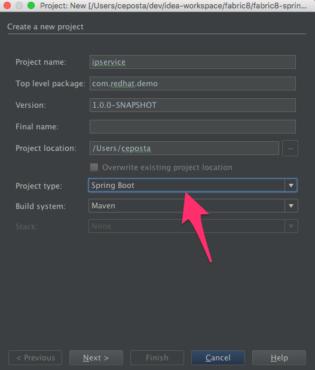.

Click next, select the Spring Boot dependencies you'd like to include in your project and click Finish. 

To add the Fabric8 tooling, select the root of your project and go back to the Forge dialog (`CMD/CTRL+ALT/OPTION+4`) and begin typing fabric8 


Again, you can add more details to the setup, but just clicking "Finish" is sufficient because fabric8 can auto-detect we're in a Spring Boot project and use appropriate defaults. Now if you open the `pom.xml` you'll see the `fabric8-maven-plugin` added:

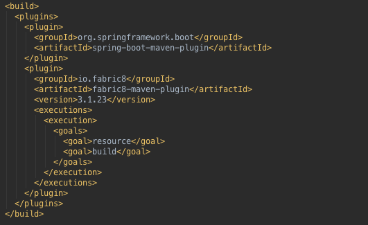

## Spring Boot on Kubernetes

Once we have our Spring Boot microservice to our liking we want to be able to package it up and deliver it to our cluster running in the Cloud. Docker provides a great abstraction (the container!) for doing this. To be able to do this while running on Mac OS X or Windows, we'll need a little help. We'll need a Docker daemon and Kubernetes to do this. Here are a few options for getting started:

* [minikube](https://github.com/kubernetes/minikube)
* [minishift](https://github.com/jimmidyson/minishift)
* [oc cluster up](https://trello.com/c/HTSNnyjV/891-13-add-oc-cluster-up-command-to-bootstrap-a-cluster-evg)
* [Red Hat Container Development Kit](http://developers.redhat.com/products/cdk/overview/)

See the fabric8 docs ([http://fabric8.io/guide/index.html](http://fabric8.io/guide/index.html)) for more details.
 
Once we have a Docker/Kubernetes environment up and have access to a Docker daemon we can build our docker images. For OpenShift users that wish to use Source to Image, see the next section. First let's verify we have docker connected properly:

```
$ docker images
```

If that command returns a list of docker images, you're ready to go.

Also make sure you're logged into Kubernetes properly:

```
$ kubectl get nodes
```

If that command returns a list of nodes (just 1 if running locally) then you're good!

Navigate to your spring boot application that we created earlier (and also to which we added the `fabric8-maven-plugin`). Try running:

```
$ mvn clean install
```

If you run a `docker images` now you should see our new Docker image built and ready to go!!

```
$ docker images
REPOSITORY                                   TAG                 IMAGE ID            CREATED             SIZE
demo/ipservice                               latest              b491738bf223        35 seconds ago      161.5 MB
example/foo                                  1.0.1               f86db95465cf        About an hour ago   161.5 MB
172.30.128.90:80/example/foo                 1.0.1               f86db95465cf        About an hour ago   161.5 MB
foo/foo                                      latest              aa5fa39e3609        21 hours ago        161.5 MB
```

That's pretty amazing. Didn't have to touch a Dockerfile or anything.

What about deploying to Kubernetes? To do that, we usually have to build a Kuberentes resource `yml` file. Take a look at the `./target/classes/META-INF/fabric8` folder:

```
$ ls -l ./target/classes/META-INF/fabric8/
total 32
drwxr-xr-x  4 ceposta  staff   136 Sep  2 14:07 kubernetes
-rw-r--r--  1 ceposta  staff  3226 Sep  2 14:07 kubernetes.json
-rw-r--r--  1 ceposta  staff  2344 Sep  2 14:07 kubernetes.yml
drwxr-xr-x  4 ceposta  staff   136 Sep  2 14:07 openshift
-rw-r--r--  1 ceposta  staff  3343 Sep  2 14:07 openshift.json
-rw-r--r--  1 ceposta  staff  2415 Sep  2 14:07 openshift.yml
```

Woah! The maven plugin generated manifest json/yml files for us! Let's take a quick look:

```
$ cat ./target/classes/META-INF/fabric8/kubernetes.yml 
---
apiVersion: "v1"
kind: "List"
items:
- apiVersion: "v1"
  kind: "Service"
  metadata:
    annotations:
      prometheus.io/port: "9779"
      prometheus.io/scrape: "true"
      fabric8.io/iconUrl: "img/icons/spring-boot.svg"
    labels:
      provider: "fabric8"
      project: "ipservice"
      version: "1.0.0-SNAPSHOT"
      group: "com.redhat.demo"
    name: "ipservice"
  spec:
    ports:
    - port: 8080
      protocol: "TCP"
      targetPort: 8080
    selector:
      project: "ipservice"
      provider: "fabric8"
      group: "com.redhat.demo"
    type: "LoadBalancer"
- apiVersion: "extensions/v1beta1"
  kind: "Deployment"
  metadata:
    annotations:
      fabric8.io/iconUrl: "img/icons/spring-boot.svg"
      fabric8.io/metrics-path: "dashboard/file/kubernetes-pods.json/?var-project=ipservice&var-version=1.0.0-SNAPSHOT"
    labels:
      provider: "fabric8"
      project: "ipservice"
      version: "1.0.0-SNAPSHOT"
      group: "com.redhat.demo"
    name: "ipservice"
  spec:
    replicas: 1
    selector:
      matchLabels:
        project: "ipservice"
        provider: "fabric8"
        group: "com.redhat.demo"
    template:
      metadata:
        annotations:
          fabric8.io/iconUrl: "img/icons/spring-boot.svg"
          fabric8.io/metrics-path: "dashboard/file/kubernetes-pods.json/?var-project=ipservice&var-version=1.0.0-SNAPSHOT"
        labels:
          provider: "fabric8"
          project: "ipservice"
          version: "1.0.0-SNAPSHOT"
          group: "com.redhat.demo"
      spec:
        containers:
        - env:
          - name: "KUBERNETES_NAMESPACE"
            valueFrom:
              fieldRef:
                fieldPath: "metadata.namespace"
          image: "demo/ipservice:latest"
          imagePullPolicy: "IfNotPresent"
          livenessProbe:
            httpGet:
              path: "/health"
              port: 8080
            initialDelaySeconds: 180
          name: "spring-boot"
          ports:
          - containerPort: 8080
            protocol: "TCP"
          - containerPort: 9779
            protocol: "TCP"
          - containerPort: 8778
            protocol: "TCP"
          readinessProbe:
            httpGet:
              path: "/health"
              port: 8080
            initialDelaySeconds: 10
          securityContext:
            privileged: false
```


Wow! It built out a Kubernetes Service and Kubernetes Deployment resource file/manifest for us! We didn't have to touch a single line of yaml/json!

Let's deploy our application then:

```
$ mvn fabric8:deploy
Java HotSpot(TM) 64-Bit Server VM warning: ignoring option MaxPermSize=1512m; support was removed in 8.0
[INFO] Scanning for projects...
[INFO]                                                                         
[INFO] ------------------------------------------------------------------------
[INFO] Building demo 1.0.0-SNAPSHOT
[INFO] ------------------------------------------------------------------------
[INFO] 
[INFO] --- fabric8-maven-plugin:3.1.23:deploy (default-cli) @ ipservice ---
[INFO] F8> Using OpenShift at https://192.168.64.7:8443/ in namespace ipservice with manifest /Users/ceposta/dev/jbds/workspaces/idsdemo/ipservice/target/classes/META-INF/fabric8/openshift.yml 
[INFO] OpenShift platform detected
[INFO] Using project: ipservice
[INFO] Creating a Service from openshift.yml namespace ipservice name ipservice
[INFO] Created Service: target/fabric8/applyJson/ipservice/service-ipservice.json
[INFO] Creating a DeploymentConfig from openshift.yml namespace ipservice name ipservice
[INFO] Created DeploymentConfig: target/fabric8/applyJson/ipservice/deploymentconfig-ipservice.json
[INFO] Creating Route ipservice:ipservice host: 
[INFO] ------------------------------------------------------------------------
[INFO] BUILD SUCCESS
[INFO] ------------------------------------------------------------------------
[INFO] Total time: 3.447 s
[INFO] Finished at: 2016-09-02T14:14:44-07:00
[INFO] Final Memory: 34M/335M
[INFO] ------------------------------------------------------------------------
```


Now if we take a look at the deployments/replicasets/pods, we should see our application has been deployed!

```
$ kubectl get pod
NAME                READY     STATUS    RESTARTS   AGE
ipservice-1-v3hjc   1/1       Running   0          1m
```

### OpenShif s2i binary builds

What if we wanted to use OpenShift to build the Docker image? What if we weren't able to install a Docker daemon locally and wanted to use OpenShift to do the docker builds? Easy! Just change the mode from (default: `kubernetes`) to `openshift`:
 
```
$ mvn clean install -Dfabric8.mode=openshift
```

Doing this will create an OpenShift BuildConfig and kick off a binary s2i build!

Then if we want to do a deploy:

```
mvn fabric8:deploy -Dfabric8.mode=openshift
```

Then the maven plugin will create the appropriate OpenShift DeploymentConfig and use the associated OpenShift ImageStreams that were created from the BuildConfig. 

This approach is great when you don't have access to a Docker daemon to kick off docker builds. Just let the OpenShift Container Platform do it for you.


## We want to continuously deliver Spring Boot microservices!

Creating a project as we did above is okay to get started. A lot of times we create projects and then for each one have to go through the steps of setting up a git repository, setting up builds in some kind of CI system, and then fabricating a deployment pipeline that suits us. Then we have to connect all those pieces together. If we want to use containers and run them in Kubernetes then we have to go try find all of the plugins and configure them (and understand the nuance of each). What if we could just do all of this with a couple clicks? 

The Fabric8 console allows us to do this. It is a webconsole for Kubernetes that has lots of goodies not the least of which is built-in CI/CD with Jenkins Pipelines. To get started creating a Spring Boot microservice and attach it to a CI/CD system, log in to the console and choose a team (default team works fine for illustration)


Next we want to create an application, so click Create Application:


If we had created our app using any of the above (Spring Initializr/STS, JBDS, or IntelliJ) we can check our code into git and import the project. But here, we're going to create a new app:

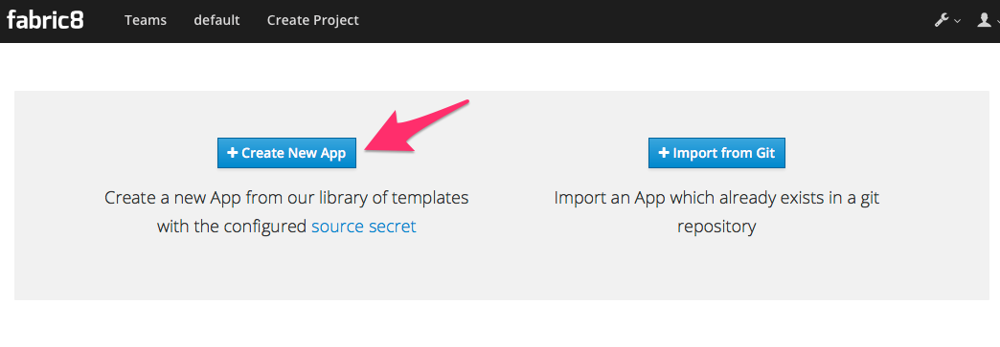

In this next dialog, we have myriad of options to choose for how we want to create our microservice. Let's choose the Spring Boot option (but Go, Integration, and WildFly Swarm are also great options!):

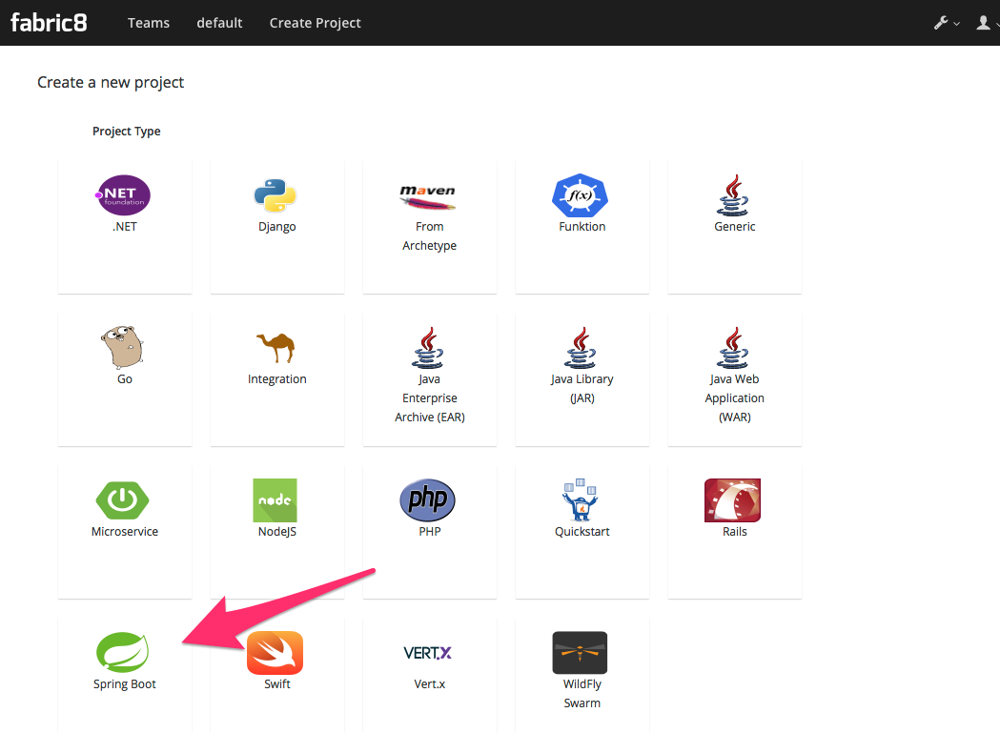

Give it a name/package name and click "Next"

Now you can see a dialog that looks similar to the http://start.spring.io page that lets you choose which version of Spring Boot you want to use and which dependencies to add:


Once you've selected the dependencies you like, click "Next"

Now you're taken to a dialog that asks us to select a CI/CD pipeline to associate with your project (eg, CanaryReleaseStageAndApprove for a pipeline with rolling upgrades between environments and approval steps). Choose a pipeline.


After selecting a pipeline, click "Next" and wait a moment for your project to be completed and everything to be set up.
You'll initially be taken to a dashboard that appears mostly empty. Give it a few minutes to come alive.


In the mean time, you can navigate to the internal git repository that comes out of the box with a fabric8 installation:

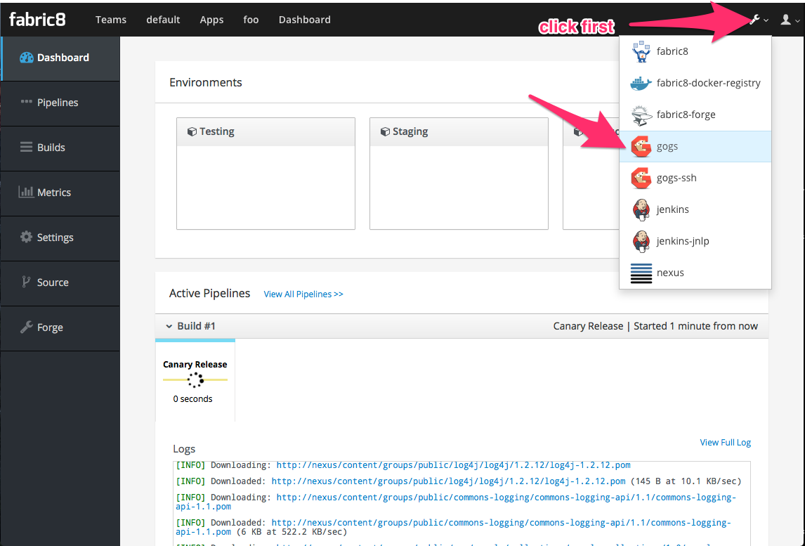

Sign in to Gogs to see the repo (note default password for the default installation of fabric8 is `gogsadmin/RedHat$1`):

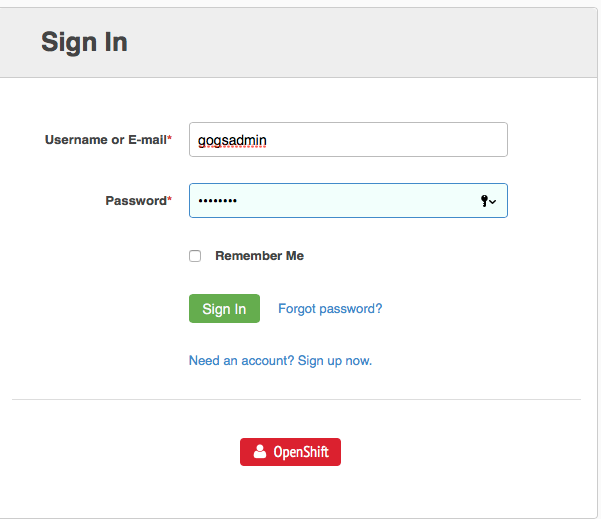

Once you've logged into the Git repo, you can navigate to find your project, and clone it to your IDE and start working where you wish. 

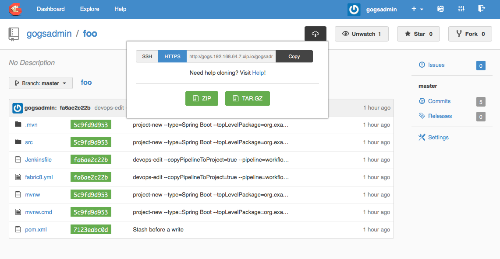

If you go back to the console after the builds take place, you should see that your new project has been automatically attached to the Fabric8 CI/CD system:

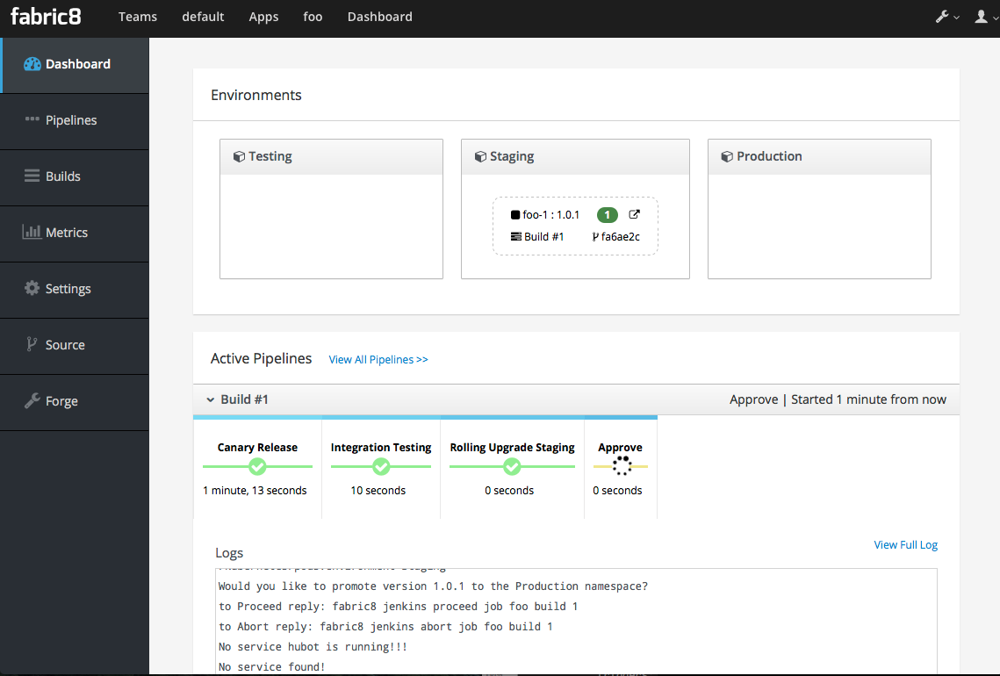

Your new Spring Boot app was checked into git, a new Jenkins Pipeline continuous delivery pipeline was set up, all builds are integrated with Nexus and the Docker registry and you've even deployed into the Staging environment. Take a browse around the Dashboard to get more familiar. The current build is waiting in an "approval" state before it can get to production. In the Build log console you should be able to see the button to "Approve" the build or "Deny" it. Additionally, if we had deployed the chat applications (LetsChat/HipChat/Slack,etc) then we could have approved/denied this build via ChatOps. Or, we could have hooked it up to a ticketing system. Or, if you like crusty old email, we could have done it like that as well.

## Where to next?

We hope this is enough to get you going. We've created Spring Boot applications from scratch and used the Fabric8 tools to help us get our application into a Kubernetes cluster. We've also covered using the awesome Fabric8 console for bootstrapping your Spring Boot app and fabricating you a CI/CD pipeline to be able to continuously deliver your microservice in the cloud. Where to next?
 
 TBD