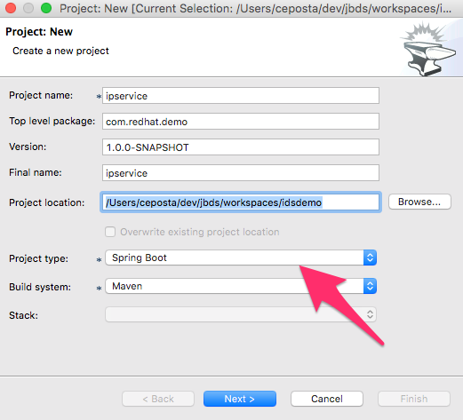
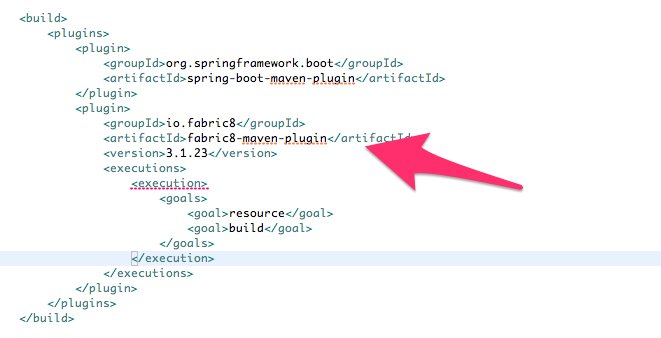
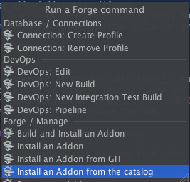
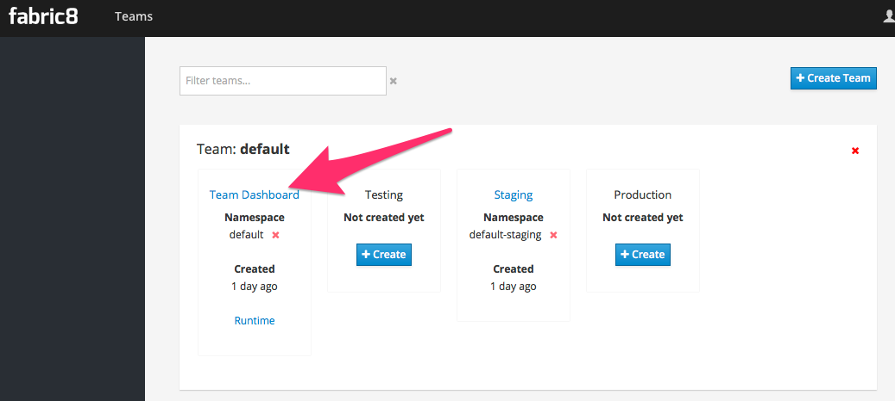
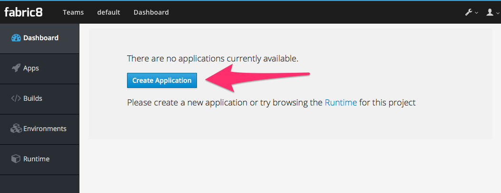
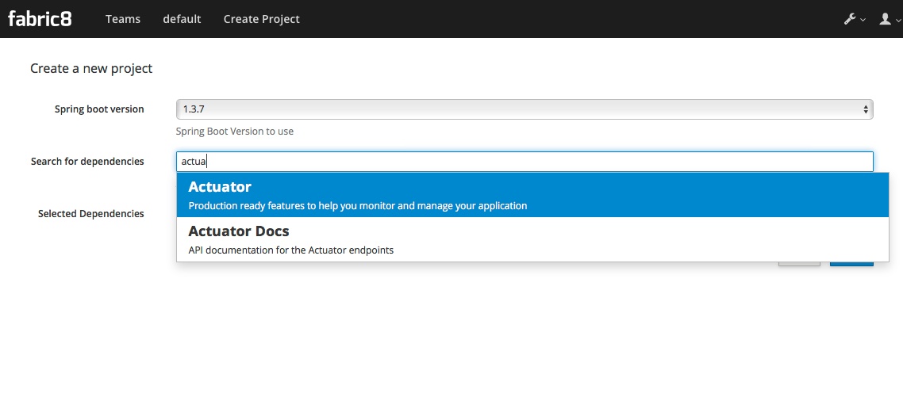
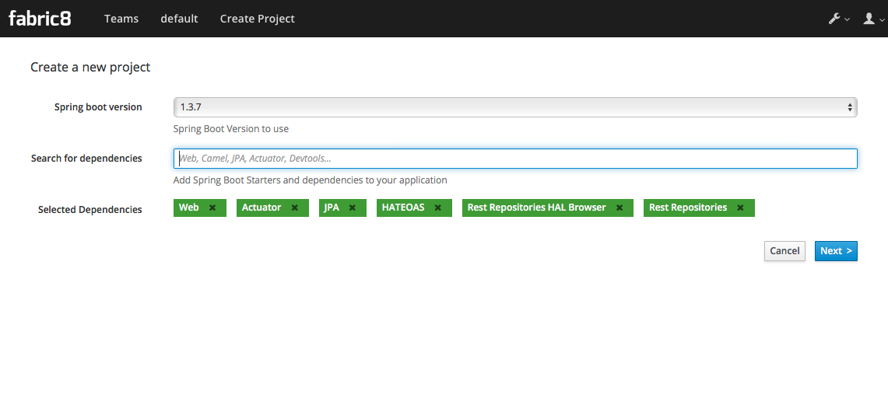
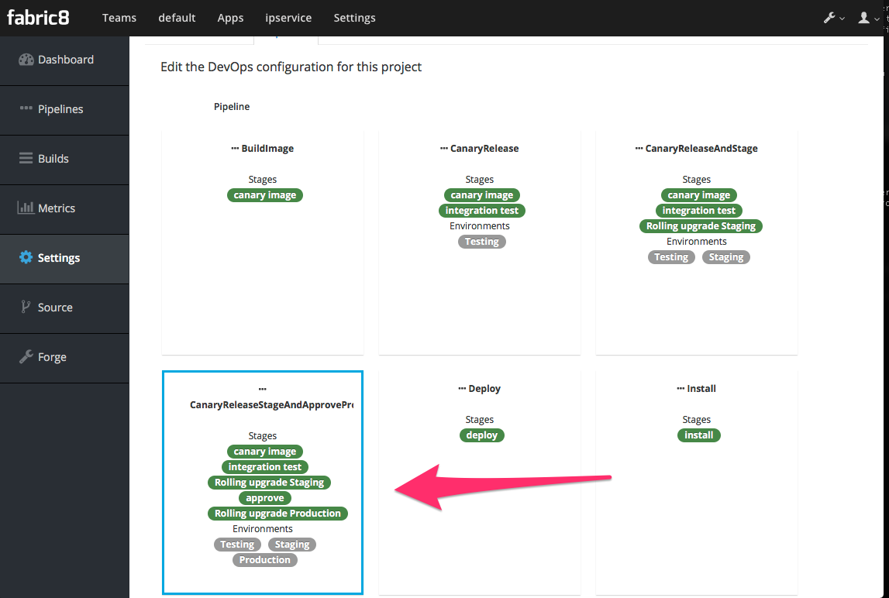
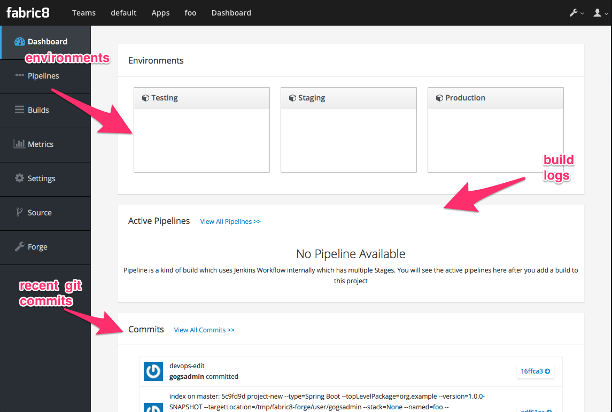

# Getting Started

This document will help you get started building applications with Spring Boot that run on Kubernetes and various distributions of Kubernetes (ie, OpenShift v3.x).
 
 
## Make JAR not WAR. Is that enough?
Spring Boot is a great way to build simple Java microservices and has a vibrant ecosystem to help facilitate. Spring Boot and its surrounding ecosystem go to great lengths to help developers get started with microservices including taking some of the pain out of configuration, health checking, boostrapping etc. For example, Spring Boot prefers an "uber-jar" model of packaging a microservice which is executable on its own. This helps  reduce the many mistakes that can happen when trying to juggle application servers + WARs/EARs as well as simplifies the classloading model for those apps that can get away with it. When we're deploying lots of microservices, we want to eliminate configuration drift as much as possible and reason about our apps without adding complications between environments.
 
Building to uber jars does help with this but is not the end of the story. As we further our quest to reduce configuration drift between environments for our apps we must also be aware of this fact: A Java based microservice depends fully on a JVM. The JVM *is* a very important implementation detail of our Java application. As are the dependencies and transitive dependencies of the JVM (libc, etc). A developer that created an app using a particular JVM on, let's say, Windows could potentially behave quite differently on a different JVM running on Linux (in a QA environment, let's say). You'll want a way to capture the complete snapshot of binaries that make up you application and Linux Containers and associated image formats is a great way to do that. 

## Isn't Docker and Kubernetes complicated?
There's an interesting dynamic between "yah we need this" and "well, it's too complicated". We can hope and pray and ignore it? But really, what if we just made it easier to build your Docker images and deploy to Kubernetes? That's what the fabric8 tooling does for you. It allows you to just use the same developer tools you use today and take advantage of building and deploying cloud-native applications on Kubernetes. 

## Do I need to do anything different for my Spring Boot app?
No! We don't have to do anything special or esoteric. Here's how we get started.
 
## Create your Spring Boot application

Go to http://start.spring.io and create your app. That's it. You have other options too:

1) With Spring Tool Suite (STS)
2) with Spring Initializr CLI
3) With JBoss Developer Studio (see below)
4) With IntelliJ, Eclipse, Netbeans (via JBoss Forge -- see below)
5) With the Fabric8 console
6) With JBoss Forge CLI
7) With maven archetypes/fabric8 quickstarts


### Spring Initializr and friends

STS, start.spring.io, and the spring-boot CLI all use Spring Initializr under the covers. At the moment, the best way to get started with the Fabric8 tooling is by adding the Fabric8 Maven Plugin:

```
<build>
  ...
     <plugins>
       <plugin>
       <groupId>io.fabric8</groupId>
       <artifactId>fabric8-maven-plugin</artifactId>
       <version>${fabric8.maven.plugin.version}</version>
       <executions>
         <execution>
           <goals>
             <goal>resource</goal>
           </goals>
         </execution>
       </executions>
       </plugin>
  ...       
```

### JBoss Developer Studio

JBoss Developer Studio has JBoss Forge tooling installed by default. Press `CTRL+4` or `CMD+4` if on Mac to get the forge window. If you haven't already, install the Fabric8 `devops` plugin which will enable the Spring Boot project wizards. You can install the addon from within JBDS by hitting `CTRL/CMD+4` and type `addon` and find the option for installing. Use the coordinate below:


```
addon-install --coordinate io.fabric8.forge:devops,2.3.18
```

Quick Note: You can also install this from the CLI.

Now when you `CTRL/CMD+4` you can type `project` and select the `Project New` option. When you begin creating the new project, fill in the Project Name, Package Name, etc. and make sure to change the Project Type to 'spring boot':
 


When you click "Next", you can choose the dependencies you like for your project (just as you can from any Spring Initializr dialog including start.spring.io). 


Clicking "Finish" will create the project for you. At this point you have a skeleton Spring Boot project into which you can add your own amazing business logic.

What about when you're ready to start using the Fabric8 tooling and build Docker images for your Kubernetes installation? 

Select the project in your project/package explorer and then hit `CTLR/CMD+4` and type `fabric8` into the dialog box filter. You should see an option for *Fabric8 Setup*. 


When the next dialog box comes up you can add metadata about which Docker image to use or which Main class to bootstrap, but in our case the fabric8 tooling is going to pick sensible defaults since it will auto-detect we have a Spring Boot application. Just click "Finish"

Now if we take a look at the pom.xml, we'll see that our `fabric8-maven-plugin` has been added:



You're now in business! Skip to the section titled "Building our Spring Boot microservice with Docker" if you're not interested in the rest. Or, watch a video of doing this whole process here:

<iframe src="https://player.vimeo.com/video/180053437" width="640" height="360" frameborder="0" webkitallowfullscreen mozallowfullscreen allowfullscreen></iframe>
<p><a href="https://vimeo.com/180053437">Spring Boot, Spring Cloud with Kubernetes and Fabric8</a> from <a href="https://vimeo.com/ceposta">Christian Posta</a> on <a href="https://vimeo.com">Vimeo</a>.</p>


### IntelliJ

JBoss Forge doesn't come out of the box with IntelliJ but through IntelliJ's amazing plugin system, we can easily added it! Just note, you should be running IntelliJ with JDK 1.8+. Newer versions of IntelliJ bundle and use JDK 1.8 out of the box. If you've an older version of IntelliJ, hit `CMD/CTRL+SHIFT+A` to get the `All Actions` dialog box and start typing `SDK`. Follow the instructions to change the SDK. 


Now you can go to the plugins dialog box and find JBoss Forge:


Now you can `CTRL+ALT+4` or `CMD+OPTION+4` on Mac to get the Forge dialog box:



Just like with the JBDS example, we'll find the "Project New" option, fill in the project information, and make sure to select Project Type of Spring Boot:

.

Click next, select the Spring Boot dependencies you'd like to include in your project and click Finish. 

To add the Fabric8 tooling, select the root of your project and go back to the Forge dialog (`CMD/CTRL+ALT/OPTION+4`) and begin typing fabric8 


Again, you can add more details to the setup, but just clicking "Finish" is sufficient because fabric8 can auto-detect we're in a Spring Boot project and use appropriate defaults. Now if you open the `pom.xml` you'll see the `fabric8-maven-plugin` added:


### Fabric8 Console

The Fabric8 console is a HTML5 webconsole for Kubernetes that has lots of goodies. To get started creating a Spring Boot application, choose a team (default team works fine)



Next we want to create an application, so click Create Application:



If we had created our app using any of the above (Spring Initializr/STS, JBDS, or IntelliJ) we can check our code into git and import the project. But here, we're going to create a new app:


In this next dialog, we have myriad of options to choose for how we want to create our microservice. Let's choose the Spring Boot option (but Go, Integration, and WildFly Swarm are also great options!):


Give it a name/package name and click "Next"

Now you can see a dialog that looks similar to the http://start.spring.io page that lets you choose which version of Spring Boot you want to use and which dependencies to add:




Once you've selected the dependencies you like, click "Next"

Now you're taken to a dialog that asks us to select a CI/CD pipeline to associate with your project (eg, CanaryReleaseStageAndApprove for a pipeline with rolling upgrades between environments and approval steps). Choose a pipeline.



After selecting a pipeline, click "Next" and wait a moment for your project to be completed and everything to be set up.
You'll initially be taken to a dashboard that appears mostly empty. Give it a few minutes to come alive.



In the mean time, you can navigate to the internal git repository that comes out of the box with a fabric8 installation:


Sign in to Gogs to see the repo (note default password for the default installation of fabric8 is `gogsadmin/RedHat$1`):


